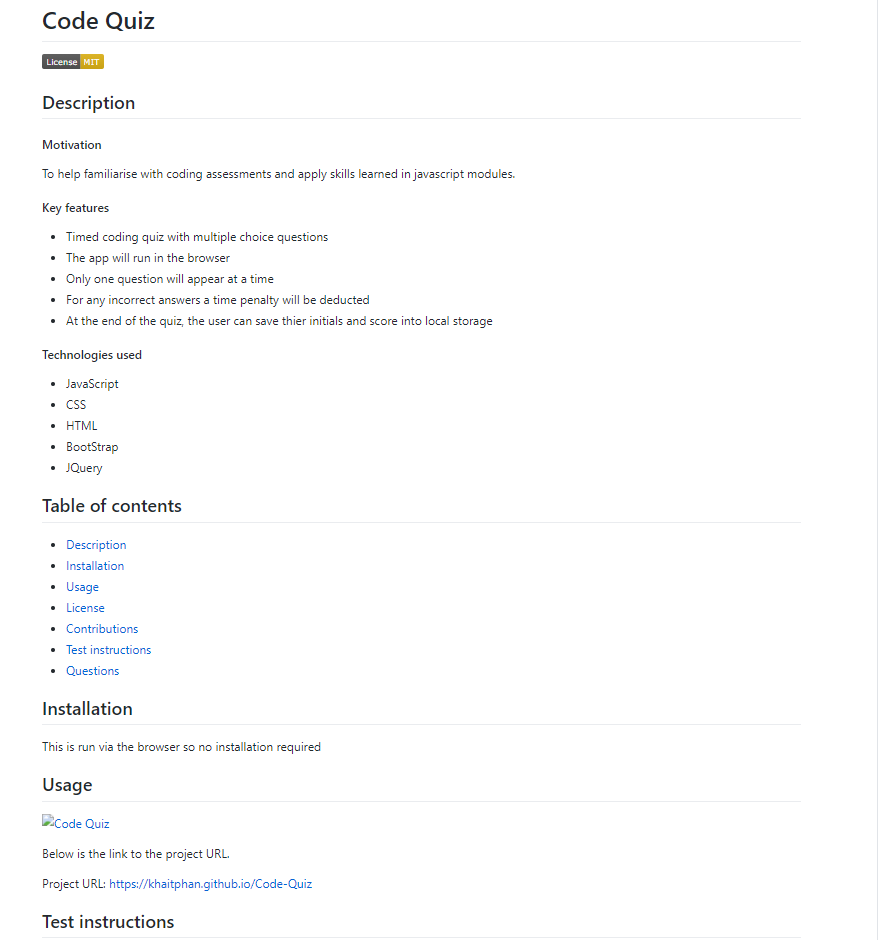

# README File Generator

[](https://opensource.org/licenses/MIT)

## Description

#### Motivation

When creating an open source project on GitHub, it’s important to have a high-quality README for the app. Writing one from scratch can be time-consuming and there's the risk you might leave oout an important section.

#### Key features

This is a command-line application to generate a READMe file in markdown language which can easily be incorporated into GitHub. It runs on node.js and the inquirer package. The user will be asked to answer a series of questions which will then populate the README file.

#### Technologies used

* JavaScript
* Node.JS
* Inquirer npm

## Table of contents

<!--ts-->
* [Description](#Description)
* [Installation](#Installation)
* [Usage](#Usage)
* [License](#License)
* [Contributions](#Contributions)
* [Test instructions](#Test-instructions)
* [Questions](#Questions)
<!--te-->

## Installation

* Install Node.JS and the inquirer package. 
* Download the index.js file

To invoke the app, check that you are in the correct folder and type the following in your terminal:

```bash
node index.js
```

## Usage

For usage information, please click on link to the video below.

https://github.com/KhaiTPhan/ReadMe-Generator/blob/main/images/README%20File%20Generator.mp4

Output of a sample README file below:


Below is the link to the project URL.

Project URL: https://khaitphan.github.io/ReadMe-Generator

## Test instructions

Nil

## License

* MIT

## Contributions

Open to contributions, please contact me via email or Github.

## Questions

If you have any questions, please contact me at:

GitHub URL: https://github.com/KhaiTPhan

Email: khai.phan.2007@gmail.com
